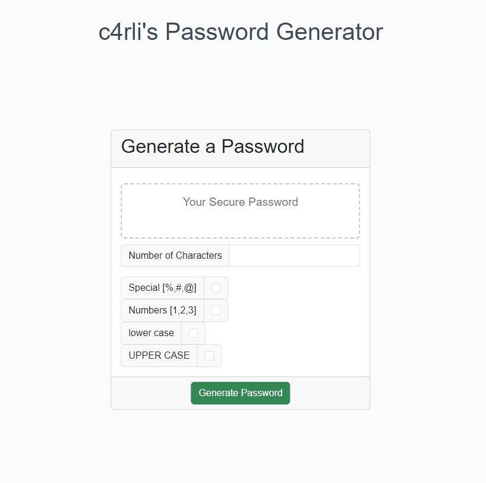

# Password-Generator
Simple password generating webapp built using HTML, CSS and JavaScript.

## Description
This repo contains source code for simple webpage that features dynamically updated HTML powered by JavaScript. 
The app generates passwords according to the options that the user has selected according to the special characters suggested by the OWASP foundation.
Deployed webpage can be found below.

### My User Story:
```
Application must:
    Generate a password when the button is clicked.
    Present a series of prompts for password criteria:
    Length of password:
    At least 10 characters but no more than 64.
    Character types:
    Lowercase
    Uppercase
    Numeric
    Special characters ($@%&*, etc.)
    Code should validate for each input and at least one character type should be selected.
    Once all prompts are answered, the password should be generated and displayed in an alert or written to the page.
```

### Features:
- Abides to special character set suggested by OWASP foundation.
- Dynamically updating HTML on password generation.
- Validates to ensure passwords are between 10 and 64 characters.

## Mock up:

### Preview of webpage:


## Installation
N/A

## Usage
Deployed webpage can be found here:  [c4rli's Password Generator](https://c4rli.github.io/Password-Generator)

## Credits
Source code written by carli n. aka c4rli ++

## License
Please refer to the LICENSE in the repo.